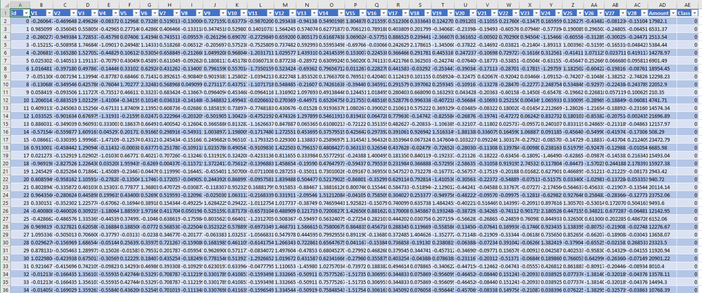
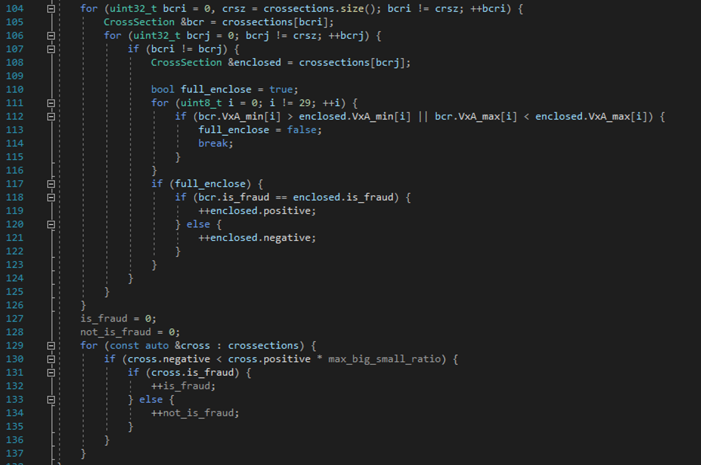

# Ленивый анализ формальных понятий с помощью интервальных узорных структур

  
### :capital_abcd: [English version](/README.md)

## Введение

Проект был направлен на проверку возможности и качества классификации "анонимизированных" объектов методом, поддающимся интерпретации. [Набор данных](https://www.kaggle.com/datasets/nelgiriyewithana/credit-card-fraud-detection-dataset-2023) включает 28 признаков и сумму транзакции. Неизвестно, за что отвечают эти признаки, но предполагается, что их достаточно для определения класса транзакции (мошенническая или нет).

Типы полей:

* `id` – **integer** – уникальный номер строки данных в наборе
* `V1…V28` – **float-point** – преобразованные некоторые признаки транзакции
* `Amount` – **decimal** – сумма транзакции
* `Class` – **integer** (0 или 1) – принадлежность транзакции к классу мошеннических

Для решения задачи были использованы интервальные узорные структуры, так как все признаки имеют тип числа с плавающей точкой. Рассматривалась идея построить некоторое количество категорий по каждому признаку, а разбиение на категории производить в зависимости от распределения значений признака. Однако, разбиение на категории может стать признаком, относящимся не к транзакции, а к репрезентативности выборки, поэтому этот путь не был реализован.

## Алгоритм

Для тестирования классификатора из входного файла с небольшой вероятностью отбираются несколько примеров. Они попадают в набор для тестирования.

Алгоритм классификации следующий:

1. Для поступившего элемента выполняется построения интервала с «тренировочным» набором.
2. Для каждого элемента набора интервалов выполняется проверка сходства другого интервала из этого набора в этот интервал.
3. Если по всем признакам обнаружено сходство, то в зависимости от того, совпадают ли целевые признаки (украдено/не украдено) меняются positive и negative счётчики у текущего рассматриваемого интервала. Если целевой признак такой же, то меняется positive, если разные – negative.
4. Когда для всех интервалов-гипотез заполнены значения счётчиков, выполняется отсеивание «плохих» гипотез. Гипотеза считается плохой, если соотношение min(positive, negative)/max(positive, negative) становится больше 1%. Этого достаточно, чтобы отсеять «нечёткие» гипотезы.
5. Выполняется подсчёт отработавших положительных гипотез и число отработавших отрицательных гипотез.

Транзакция классифицируется как мошенническая, если: 

$$\frac{a}{c}>\frac{b}{d},$$

где `a` - кол-во *пересечений* с гипотезами о достоверно мошеннических транзакциях, `c` - кол-во гипотез о достоверно мошеннических транзакциях, `b` - кол-во *пересечений* с гипотезами об обычных транзакциях, `d` - кол-во гипотез об обычных транзакциях.

Процент уверенности в вердикте вычисляется следующим образом (обозначения те же):

$$P=\left(1-\frac{\mathop{\text{min}}\left(\frac{a}{c},\frac{b}{d}\right)}{\mathop{\text{max}}\left(\frac{a}{c},\frac{b}{d}\right)}\right)*100$$

## Запуск

В рамках тестового запусков было выполнено 10 классификаций: 5 на положительных примерах, 5 на отрицательных.

Было получено следующее распределение:

| №  | Достоверно мошенническая | Классификация (#гипотез) | Классификация (#гипотез) | Общее число гипотез | Общее число гипотез |
| :--: | :--: | ---- | ---- | ---- | ---- |
| № | Достоверно мошенническая | Мошенническая | Обычная | Мошенническая | Обычная |
| 1 | нет | 284159 | 284177 | 284159 | 284190 |
| 2 | нет | 284159 | 284190  | 284159 | 284190 |
| 3 | нет | 96555 | 284172 | 284159 | 284190 |
| 4 | нет | 266939 | 284185 | 284159 | 284190 |
| 5 | нет | 284159 | 284189 | 284159 | 284190 |
| 6 | да | 284159 | 284182 | 284159 | 284190 |
| 7 | да | 284159 | 284190 | 284159 | 284190 |
| 8 | да | 284159 | 284183 | 284159 | 284190 |
| 9 | да | 284137 | 284190 | 284159 | 284190 |
| 10 | да | 284149  | 254758 | 284159 | 284190 |

Далее, если вынести вердикт согласно формулам выше:

| № | Достоверно мошенническая | Вердикт классификатора | Уверенность классификатора | Правота классификатора |
| :--: | :--: | :--: | :--: | :-- |
| 1 | нет | да | 0% | unclassified |
| 2 | нет | нет | 0% | unclassified |
| 3 | нет | нет | 66,02% | right |
| 4 | нет | нет | 6,06% | right |
| 5 | нет | да | 0% | unclassified |
| 6 | да | да | 0% | unclassified |
| 7 | да | нет | 0% | unclassified |
| 8 | да | да | 0% | unclassified |
| 9 | да | нет | 0,01% | unclassified |
| 10 | да | да | 10,35% | right |

Если считать, что классификатор смог провести классификацию только если его уверенность больше 1%, то получится, что он ни разу не ошибся, но, вместе с тем, не смог классифицировать 70% данных...

Вероятно, это может быть связано с особенностями набора данных (механизмом процесса "анонимизации" данных при подготовке набора), так как на закрытом датасете (для работы на котором классификатор был разработан), результаты получились лучше.

### P.S.

Когда классификатор был однопоточным, он выглядел вот так (в коммите он многопоточный и выглядит сложнее).

