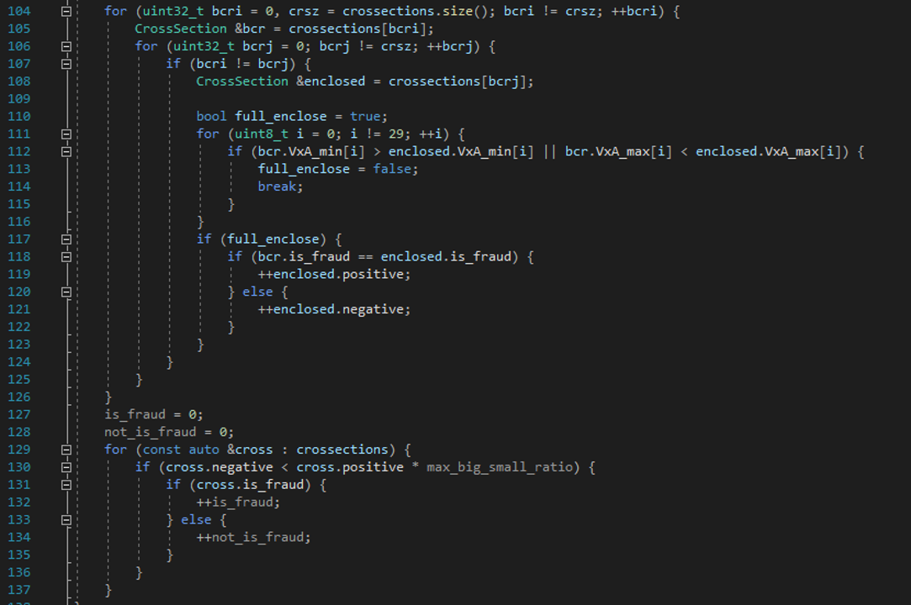

# Lazy Formal Concept Analysis via Interval Pattern Structures

  
### :capital_abcd: [Версия на русском языке](/README-ru.md)

## Introduction

The project was aimed at verifying the possibility and quality of classifying "anonymized" objects by an interpretable method. [The dataset](https://www.kaggle.com/datasets/nelgiriyewithana/credit-card-fraud-detection-dataset-2023) includes 28 attributes and the transaction amount. It is not known what these signs are responsible for, but it is assumed that they are sufficient to determine the class of transaction (fraudulent or not).

CSV feild types:

* `id` – **integer** – the unique number of the data row in the set
* `V1…V28` – **float-point** – converted some transaction attributes
* `Amount` – **decimal** – transaction amount
* `Class` – **integer** (0 or 1) – the transaction belongs to the class of fraudulent

Interval pattern structures were used to solve the problem, since all the signs are of the floating-point number type. The idea was considered to build a certain number of categories for each attribute, and to divide into categories depending on the distribution of the attribute values. However, categorization may become a feature related not to the transaction, but to the representativeness of the sample, so this path has not been implemented.

## Algorithm

To test the classifier, several examples are selected from the input file with a low probability. They get into the testing kit.

The classification algorithm is as follows:

1. For the received element, an interval with a "training" set is being constructed.
2. For each element of the interval set, the similarity of another interval from this set to this interval is checked.
3. If there is a similarity in all signs, then depending on whether the target signs match (stolen/ not stolen), the positive and negative counters for the current interval under consideration change. If the target attribute is the same, then positive changes, if different – negative.
4. When the counter values are filled in for all hypothesis intervals, the "bad" hypotheses are screened out. The hypothesis is considered bad if the ratio min(positive, negative)/max(positive, negative) becomes greater than 1%. This is enough to weed out the "fuzzy" hypotheses.
5. The calculation of spent positive hypotheses and the number of spent negative hypotheses is performed.

A transaction is classified as fraudulent if: 
$$\frac{a}{c}>\frac{b}{d},$$
where `a` is the number of *intersections* with hypotheses about reliably fraudulent transactions, `c` is the number of hypotheses about reliably fraudulent transactions, `b` is the number of *intersections* with hypotheses about ordinary transactions, `d` is the number of hypotheses about ordinary transactions.

The percentage of confidence in the verdict is calculated as follows (the notation is the same):
$$P=\left(1-\frac{\operatorname{min}\left(\frac{a}{c},\frac{b}{d}\right)}{\operatorname{max}\left(\frac{a}{c},\frac{b}{d}\right)}\right)*100$$

## Test run

As part of the test runs, 10 classifications were performed: 5 on positive examples, 5 on negative ones.

The following distribution was obtained:

| No. | Reliably fraudulent | Classification (#of hypotheses) | Classification (#of hypotheses) | Total number of hypotheses | Total number of hypotheses |
| :--: | :--: | ---- | ---- | ---- | ---- |
| No. | Reliably Fraudulent | Fraudulent | Regular | Fraudulent | Regular |
| 1 | no | 284159 | 284177 | 284159 | 284190 |
| 2 | no | 284159 | 284190  | 284159 | 284190 |
| 3 | no | 96555 | 284172 | 284159 | 284190 |
| 4 | no | 266939 | 284185 | 284159 | 284190 |
| 5 | no | 284159 | 284189 | 284159 | 284190 |
| 6 | yes | 284159 | 284182 | 284159 | 284190 |
| 7 | yes | 284159 | 284190 | 284159 | 284190 |
| 8 | yes | 284159 | 284183 | 284159 | 284190 |
| 9 | yes | 284137 | 284190 | 284159 | 284190 |
| 10 | yes | 284149  | 254758 | 284159 | 284190 |

Next, if you make a verdict according to the formulas above:

| No. | Reliably fraudulent | The verdict of the classifier | The confidence of the classifier | The correctness of the classifier |
| :--: | :--: | :--: | :--: | :-- |
| 1 | no | yes | 0% | unclassified |
| 2 | no | no | 0% | unclassified |
| 3 | no | no | 66,02% | right |
| 4 | no | no | 6,06% | right |
| 5 | no | yes | 0% | unclassified |
| 6 | yes | yes | 0% | unclassified |
| 7 | yes | no | 0% | unclassified |
| 8 | yes | yes | 0% | unclassified |
| 9 | yes | no | 0,01% | unclassified |
| 10 | yes | yes | 10,35% | right |

If we assume that the classifier was able to classify only if its confidence is greater than 1%, then it turns out that it has never made a mistake, but, at the same time, could not classify 70% of the data...

This may probably be due to the features of the dataset (the mechanism of the data "anonymization" process during the preparation of the dataset), since the results turned out better on a closed dataset (for which the classifier was developed).

### P.S.

When the classifier was single-threaded, it looked like this (in the commit it is multithreaded and looks more complicated).

